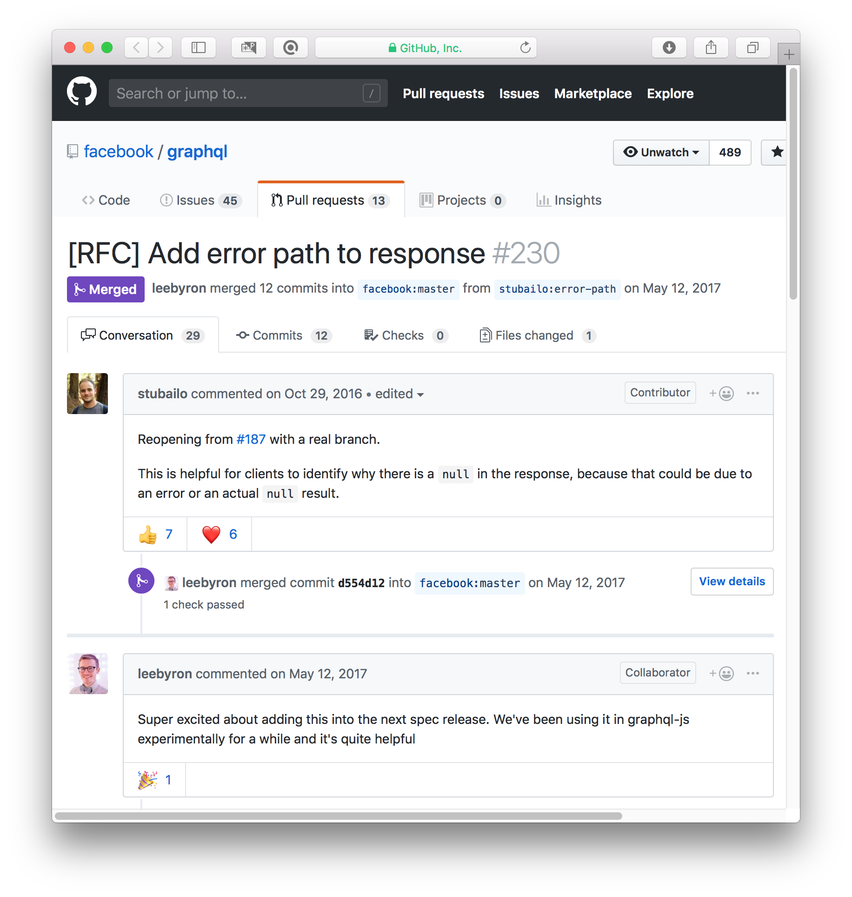
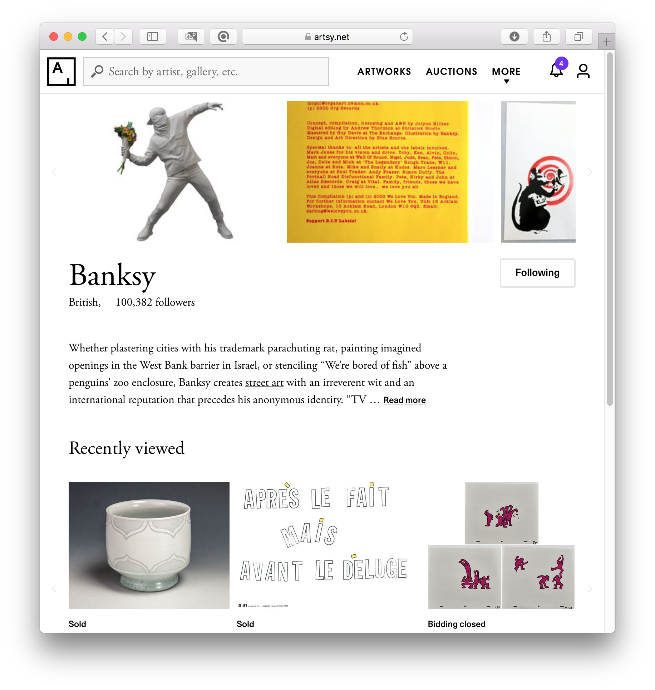
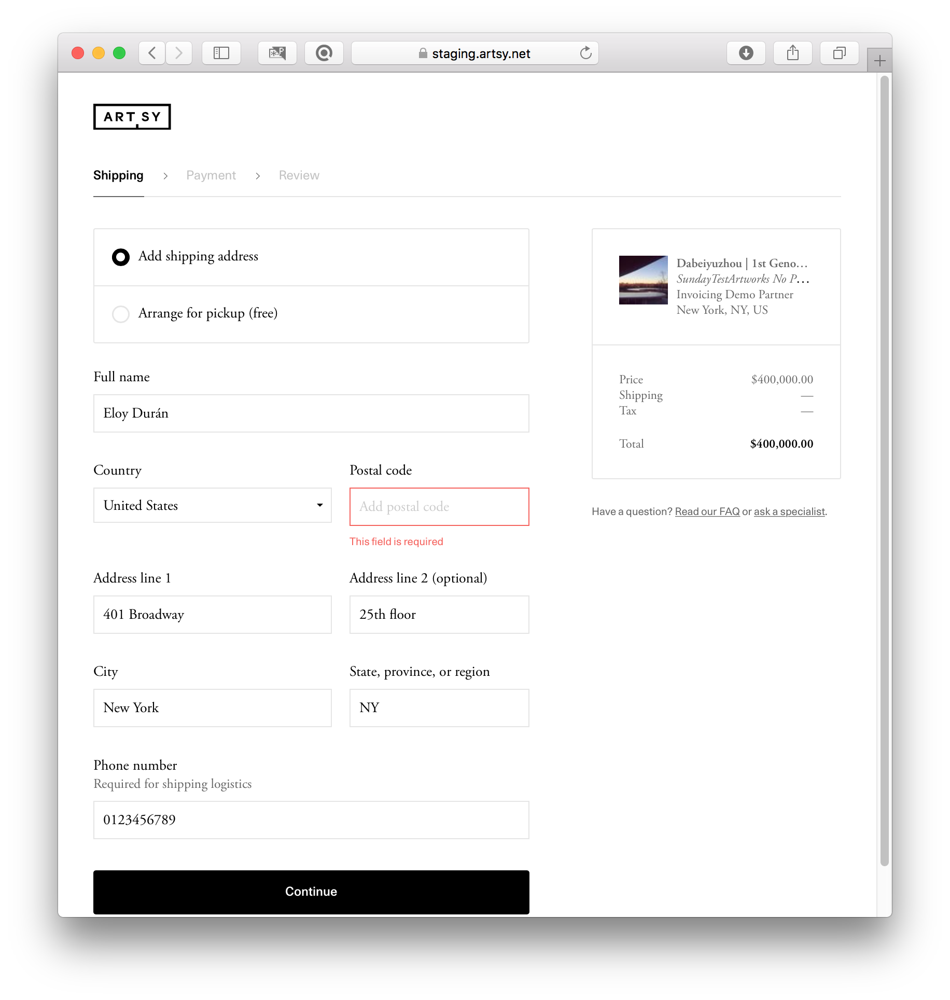
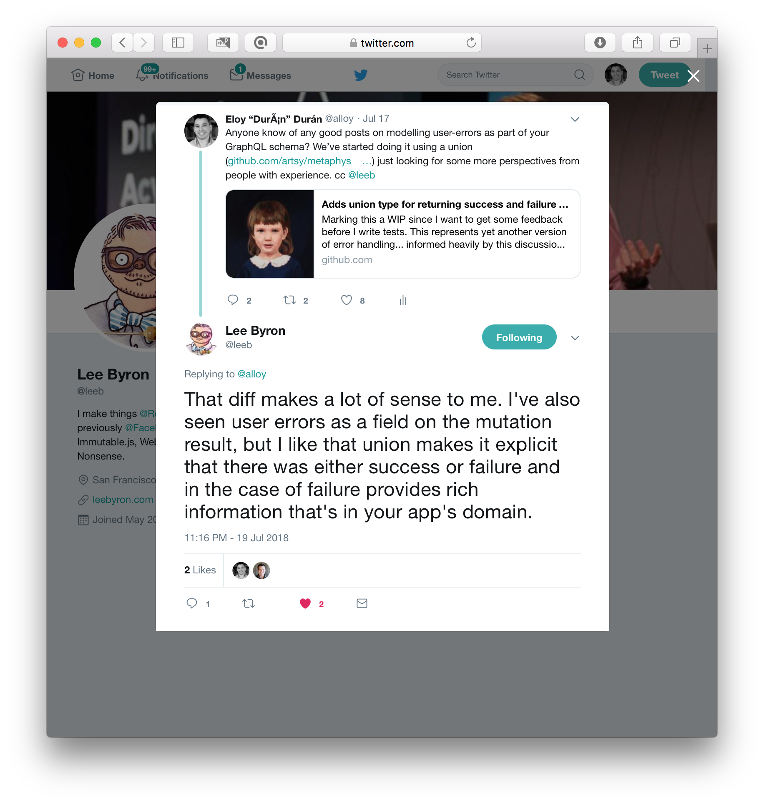

# Where art thou,
# my error?
### _@alloy - artsy.net_

[.background-color: #FFFFFF]

^
- I’m Eloy
- Engineer at Artsy
- We use GraphQL since 2015

----

# Still early days

^
- Exciting
- Spec is minimal, let
  community define problems

----



^
- Error path is example

----

# Still early days

^
- We can still shape future
- Much thinking and
  experimenting
- Because backwards compat
  we should share iterations
- This is our story on errors

----

# 🙉

^
- Will use query execution
- document execution doesn’t
  sound natural
- Come at me, at bar

----

# Errors _vs_ Errors

^
- Errors in general
- It gets confusing

[.background-color: #FFFFFF]

----

# Errors _vs_ Errors

^
- Won’t talk about errors
  outside query execution
- Such as:
* network failure reaching
  GraphQL server
* syntax error
* variables that don’t satisfy
  type-system

[.background-color: #FFFFFF]

----

# Errors _vs_ Errors

^
- These all reject query entirely
- Solve using traditional means
- e.g. HTTP 4xx/5xx

[.background-color: #FFFFFF]

----

# Errors _vs_ Errors

^
- We’ll talk about 2

[.background-color: #FFFFFF]

----

# GraphQL Errors

^
- Unexpected
- Could lead to corrupted data

----

# GraphQL Errors

^
- Causes:
* Incorrect API usage
* hardware failures (mem, disk)
* upstream network failures
* unexpected upstream data

----

#### GraphQL Errors

[.text: alignment(left)]
[.code-highlight: 6, 11-14]

```javascript
{
  data: {
    artwork: {
      artist: {
        name: "Vincent van Gogh",
        leftEarSize: null
      }
    }
  },
  errors: [
    {
      message: "An unexpected error occurred",
      path: ["artwork", "artist", "leftEarSize"]
    }
  ]
}
```

^
- field resolves to null
- top-level error added

----

# Exceptions

^
- Known to occur
- Expected to be handled
  by user of API
- Treated same as GraphQL Errors
  if uncaught

----

# What’s the problem?

[.background-color: #FFFFFF]

^
- GraphQL fetches data for
  multiple resources
- Some fields resolve,
  some fail
- Advice for transport is
  always HTTP 200
- How to process errors
  is left to client

----

# What’s the problem?

[.background-color: #FFFFFF]

^
- So how to model errors
- meaningfully
- in context of origin

----

# Partial data

^
- What if you want
  to render?

----



^
- Unrelated components

----


^
- Part of list
- Others can render fine

----

# Communicate error

^
- What if you want
  to show in UI?

----


^
- Display authz needed


----



^
- Mutation validation errors

----

# Possible solutions

[.background-color: #FFFFFF]

----

# GraphQL Errors
# and reject entire
# response

_https://u.nu/atrh_
_https://u.nu/pjv-_

^
- Apollo, Relay Classic
- Clients can only assume
  data is incomplete
- Not if app can handle
  partial data

----

# GraphQL Errors
# with metadata

_https://u.nu/r5-2_

^
- Errors only have message
  context field
- Spec also has extensions
- Free for schema implementor

----

# GraphQL Errors
# with metadata

_https://u.nu/r5-2_

^
- Apollo Server 2 uses it
- Throw error from resolver
- Serialized into extensions

----

#### GraphQL Errors with metadata

[.text: alignment(left)]

```js
import { UserInputError } from 'apollo-server';

const resolvers = {
  Query: {
    events(root, { zipCode }) {
      if (!isValidZipCode(zipCode)) {
        throw new UserInputError(
          'Failed to get events due to validation errors',
          { validationErrors: {
            zipCode: 'This is not a valid zipcode'
          }}
        );
      }
      return getEventsByZipcode(zipCode);
    }
  }
}
```

^
- eg bad input

----

# GraphQL Errors
# with metadata

_https://u.nu/r5-2_

^
- But, freeform
- Implicit contract server & client
- Needs abstracted client code
- Unfortunate, GraphQL should be
  used to express shape of data

----

# GraphQL Errors
# with metadata

# [fit] **While convenient, the weakness of this approach is that the format of the validation error messages<br />is not captured by your schema, making it brittle to changes. Unless you maintain tight control<br />of both server and client, you should keep the error responses as simple as possible.<br />For mutations, it can be worthwhile defining these validation errors as first class citizens within your schema.**

^
- Apollo team acknowledges
- Which we’ll describe next

----

# Extra (mutation)
# error fields

_https://u.nu/th7y_

^
- Approach for mutations
- Metadata on response type

----

#### Extra (mutation) error fields

[.text: alignment(left)]

```graphql
type UpdateArtworkMutationResponse {
  success: Boolean!
  message: String!
  artwork: Artwork
}
```

^
- bool for status
- message for context
- the artwork

----

#### Extra (mutation) error fields

[.text: alignment(left)]

```graphql
type UpdateArtworkMutationResponse {
  success: Boolean!
  message: String!
  artwork: Artwork
}
```

^
- adding here makes sense
  for failures
- but what about success?
* do we need a bool?
* why have message?
* (besides feel-good message)

----

# Extra (mutation)
# error fields

_https://u.nu/th7y_

^
- only works well with mutations
- their return type is a query root
- so can pollute namespace

----

# Extra error
# field & type

_https://u.nu/-3pw_

^
- Similar, but also for queries
- Add error field to type

----

#### Extra error field & type

[.text: alignment(left)]

```graphql
type GenericError {
  message: String!
}

type UpdateArtworkMutationResponse {
  error: GenericError
  artwork: Artwork
}
```

^
- when error != null, failure
- cleans-up namespace

----

#### Extra error field & type

[.text: alignment(left)]

```graphql
type PublishedArtworkNotification {
  artwork: Artwork
}

type PublishedArtworkNotificationsPayload {
  error: GenericError
  notifications: [PublishedArtworkNotification]
}

type Query {
  publishedArtworkNotificationsPayload:
    PublishedArtworkNotificationsPayload!
}
```

^
- also useable on queries
- neat
- but in our case we don’
  have partial data
- we want either success or fail
- this approach would lead to
  either field being null
- or worse, ambiguous

----

# Extra error
# field & type

_https://u.nu/-3pw_
_Side-note: https://u.nu/i0yg_

^
- when not in control of server
- client can extend schema
- retrofit GraphQL Errors
- based on path field

----

# Recap

[.background-color: #FFFFFF]

----

# Recap

[.background-color: #FFFFFF]

* Use GraphQL

^
utilize GraphQL to explicitly describe the error data

----

# Recap

[.background-color: #FFFFFF]

* Use GraphQL
* In context

^
present the error data where the error occurred in the schema

----

# Recap

[.background-color: #FFFFFF]

* Use GraphQL
* In context
* All operations

^
work for both mutations and queries

----

# Recap

[.background-color: #FFFFFF]

* Use GraphQL
* In context
* All operations
* Explicit status

^
be concise and encourage ‘clean’ types; that is, no pollution of namespaces with fields only needed in some cases

----

# Exceptions as
# first-class citizens

^
- ticks all the boxes
- we started adopting this
- exceptions are own type
- union with success type
- query explicitly
- benefits are:

----

#### Exceptions as first-class citizens

[.text: alignment(left)]

```graphql
type Artwork {
  title: String!
}

type HTTPError {
  message: String!
  statusCode: Int!
}

union ArtworkOrError = Artwork | HTTPError

type Query {
  artworkOrError(id: ID!): ArtworkOrError
}

query {
  artworkOrError("mona-lisa") {
    ... on Artwork {
      title
    }
    ... on HTTPError {
      statusCode
    }
  }
}
```

^
- model explicit
- introspect-able
- HTTP error to upstream service
  can have status-code field
- document as such

----

#### Exceptions as first-class citizens

[.text: alignment(left)]

```graphql
type Artist {
  artworksOrErrors: [ArtworkOrError]
}

type Query {
  artist(id: ID!): Artist
}

query {
  artist("leonardo-da-vinci") {
    artworksOrErrors {
      ... on Artwork {
        title
      }
      ... on HTTPError {
        statusCode
      }
    }
  }
}
```

^
- in context

----

#### Exceptions as first-class citizens

[.text: alignment(left)]

```graphql
type UpdateArtworkMutationResponse {
  artworkOrError: ArtworkOrError
}
```

^
- works for all operations

----

#### Exceptions as first-class citizens

[.text: alignment(left)]

```graphql
query {
  artworkOrError("mona-lisa") {
    ... on Artwork {
      title
    }
  }
}
```

^
- single field
- either success _or_ failure
- no pollution if not interested in error

----

# How we use it

[.background-color: #FFFFFF]

^
- preface that we just started
- not all exist in prod schema

----

# Types

[.text: alignment(left)]
[.code-highlight: 19, 22]

```graphql
interface Error {
  message: String!
}

interface HTTPError {
  message: String!
  statusCode: Int!
}

type HTTPErrorType implements Error & HTTPError {
  message: String!
  statusCode: Int!
}

type Artwork {
  title: String!
}

union ArtworkOrError = Artwork | HTTPErrorType

type Query {
  artworkOrError(id: ID!): ArtworkOrError
}
```

^
- as shown before
- union of success and error

----

# Types

[.text: alignment(left)]
[.code-highlight: 1-10]

```graphql
interface Error {
  message: String!
}

interface HTTPError {
  message: String!
  statusCode: Int!
}

type HTTPErrorType implements Error & HTTPError {
  message: String!
  statusCode: Int!
}

type Artwork {
  title: String!
}

union ArtworkOrError = Artwork | HTTPErrorType

type Query {
  artworkOrError(id: ID!): ArtworkOrError
}
```

^
- additional interfaces
- clients can treat errors generically

----

# Types

[.text: alignment(left)]

```graphql
query {
  artworkOrError("mona-lisa") {
    ... on Artwork {
      title
    }
    ... on HTTPError {
      message
      statusCode
    }
  }
}
```

^
still query as shown before

----

# Types

[.text: alignment(left)]

```graphql
query {
  artworkOrError("mona-lisa") {
    ... on Artwork {
      title
    }
    ...GenericErrorComponent
    ...GenericHTTPErrorComponent
  }
}

fragment GenericErrorComponent on Error {
  message
}

fragment GenericErrorComponent on HTTPError {
  message
  statusCode
}
```

^
clients can now have generic components

----

# Types

[.text: alignment(left)]
[.code-highlight: 1, 10]

```graphql
interface Error {
  message: String!
}

interface HTTPError {
  message: String!
  statusCode: Int!
}

type HTTPErrorType implements Error & HTTPError {
  message: String!
  statusCode: Int!
}

type Artwork {
  title: String!
}

union ArtworkOrError = Artwork | HTTPErrorType

type Query {
  artworkOrError(id: ID!): ArtworkOrError
}
```

^
- no interfaces in prod yet
- is `Error` too generic?
- other naming pattern that avoids
  `...Type`?

----

# Types

_Side-note: https://u.nu/c1ye_

^
- RFC interfaces implement interfaces
- removed need to repeat
- has traction
- yay!

----

# Field naming

‘something’ _or_ error

^
- fields are named like this
- for us backwards compat
- we can extend existing unions
- but can’t change to unions
- instead we have 2 fields

----

# Field naming

[.text: alignment(left)]

```graphql
query {
  artwork("mona-lisa") {
    title
  }
}
```

^
one with single nullable type

----

# Field naming

[.text: alignment(left)]

```graphql
query {
  artworkOrError("mona-lisa") {
    ... on Artwork {
      title
    }
    ... on HTTPError {
      statusCode
    }
  }
}
```

^
another with error union type

----

# Field naming

[.text: alignment(left)]

```graphql
type Query {
  artworks: [artwork]
  artworksConnection: ArtworksConnection
}
```

^
- slightly unfortunate re clean design
- not uncommon, eg connection
- we’ll see how this feels

----

# Downside of union

[.text: alignment(left)]

```graphql
type ArtworkPurchasableBox {
  value: Boolean!
}

union ArtworkPurchasableOrError = ArtworkPurchasableBox | HTTPError

type Artwork {
  currentlyPurchasableOrError: ArtworkPurchasableOrError
}
```

^
- notable downside
- union can’t contain scalar
- needs to be boxed

----

# Downside of union

[.text: alignment(left)]

```graphql
type ArtworkPurchasableBox {
  value: Boolean!
}

union ArtworkPurchasableOrError = ArtworkPurchasableBox | HTTPError

type Artwork {
  currentlyPurchasableOrError: ArtworkPurchasableOrError
}
```

^
- useful that we have 2 fields
- one with and one without error
- querying through box is inelegant

----

# Downside of union

_Side-note: https://u.nu/c29p_

^
- RFC re scalar in union
- stage 0, needs champion
- we may, after using this

----

#### Example of query usage

[.text: alignment(left)]

```javascript
import { OrderStatus_order } from "__generated__/OrderStatus_order.graphql"
import { createFragmentContainer, graphql } from "react-relay"

interface Props { order: OrderStatus_order }

const OrderStatus: React.SFC<Props> = ({ order: orderStatusOrError }) =>
  orderStatusOrError.__typename === "OrderStatus" ? (
    <div>
      {orderStatusOrError.deliveryDispatched
        ? "Your order has been dispatched."
        : "Your order has not been dispatched yet."}
    </div>
  ) : (
    <div className="error">
      {orderStatusOrError.code === "unpublished"
        ? "Please contact gallery services."
        : `An unexpected error occurred: ${orderStatusOrError.message}`}
    </div>
  )

export const OrderStatusContainer = createFragmentContainer(
  OrderStatus,
  graphql`
    fragment OrderStatus_order on Order {
      orderStatusOrError {
        __typename
        ... on OrderStatus {
          deliveryDispatched
        }
        ... on OrderError {
          message
          code
        }
      }
    }
  `
)
```

----

#### Example of mutation usage

[.text: alignment(left)]

```javascript
import { SubmitOrder_order } from "__generated__/SubmitOrder_order.graphql"
import { SubmitOrderMutation } from "__generated__/SubmitOrderMutation.graphql"
import { Router } from "found-relay"
import { commitMutation, createFragmentContainer, graphql, RelayProp } from "react-relay"

interface Props { order: SubmitOrder_order, relay: RelayProp, router: Router }

const SubmitOrder: React.SFC<Props> = props => (
  <button
    onClick={() => {
      commitMutation<SubmitOrderMutation>(props.relay.environment, {
        mutation: graphql`
          mutation SubmitOrderMutation($input: SubmitOrder!) {
            submitOrder(input: $input) {
              orderStatusOrError {
                __typename
                ... on OrderStatus {
                  submitted
                }
                ... on OrderError {
                  message
                  code
                }
              }
            }
          }
        `,
        variables: { input: { orderID: props.order.id } },
        onCompleted: ({ submitOrder: { orderStatusOrError } }, errors) => {
          if (orderStatusOrError.__typename === "OrderStatus") {
            props.router.push(
              `/orders/${props.order.id}/${
                orderStatusOrError.submitted ? "submitted" : "pending"
              }`
            )
          } else {
            alert(
              orderStatusOrError.code === "unpublished"
                ? "Please contact gallery services."
                : `An unexpected error occurred: ${orderStatusOrError.message}`
            )
          }
        },
      })
    }}
  />
)

export const SubmitOrderContainer = createFragmentContainer(…)
```

----

# Final thoughts

[.background-color: #FFFFFF]

🏁

^
- again, only just started
- but much thought/experimentation
- it addresses our needs

----

# Final thoughts

[.background-color: #FFFFFF]

📣 @alloy

^
- want feedback
- especially when adopting

----

# Final thoughts

[.background-color: #FFFFFF]

👫📈🤩

^
- as community openly iterate together
- as we try to make future of GraphQL great

----

# Final thoughts

[.background-color: #FFFFFF]

…to ‘REST’ 😉

^
- and put legit questions to rest

----



^
- leave you with message from internet rando

