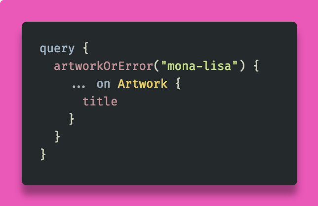

# Where art thou,
# my error?
### _@alloy - artsy.net_
#### https://github.com/alloy/graphql-finland

[.background-color: #FFFFFF]

^
- I’m Eloy
- Engineer at Artsy
- We use GraphQL since 2015

----

# Still early days

^
- Exciting
- Spec is minimal, let
  community define problems

----

# Still early days

^
- Error path is example

----

# Still early days

^
- We can still shape future
- Much thinking and
  experimenting
- Because backwards compat
  we should share iterations
- This is our story on errors

----

# 🙉

^
- Will use query execution
- document execution doesn’t
  sound natural
- Come at me, at bar

----

# Errors _vs_ Errors

^
- Errors in general
- It gets confusing

[.background-color: #FFFFFF]

----

# Errors _vs_ Errors

^
- Won’t talk about errors
  outside query execution
- Such as:
* network failure reaching
  GraphQL server
* syntax error
* variables that don’t satisfy
  type-system

[.background-color: #FFFFFF]

----

# Errors _vs_ Errors

^
- These all reject query entirely
- Solve using traditional means
- e.g. HTTP 4xx/5xx

[.background-color: #FFFFFF]

----

# Errors _vs_ Errors

^
- We’ll talk about 2

[.background-color: #FFFFFF]

----

# GraphQL Errors

^
- Unexpected
- Could lead to corrupted data

----

# GraphQL Errors

^
- Causes:
* Incorrect API usage
* hardware failures (mem, disk)
* upstream network failures
* unexpected upstream data

----

# GraphQL Errors

^
- field resolves to null
- top-level error added

----

# Exceptions

^
- Known to occur
- Expected to be handled
  by user of API
- Treated same as GraphQL Errors
  if uncaught

----

# What’s the problem?

[.background-color: #FFFFFF]

^
- GraphQL fetches data for
  multiple resources
- Some fields resolve,
  some fail
- Advice for transport is
  always HTTP 200
- How to process errors
  is left to client

----

# What’s the problem?

[.background-color: #FFFFFF]

^
- So how to model errors
- meaningfully
- in context of origin

----

# Partial data

^
- What if you want
  to render?

----

# Partial data

^
- Unrelated components

----

# Partial data

^
- Unrelated components

----

# Partial data

^
- Part of list
- Others can render fine

----

# Partial data

^
- Part of list
- Others can render fine

----

# Communicate error

^
- What if you want
  to show in UI?

----

### Communicate error

^
- Mutation validation errors

----

# Possible solutions

[.background-color: #FFFFFF]

----

# GraphQL Errors
# and reject entire
# response

_https://u.nu/atrh_
_https://u.nu/pjv-_

^
- Apollo, Relay Classic
- Clients can only assume
  data is incomplete
- Not if app can handle
  partial data

----

# GraphQL Errors
# with metadata

_https://u.nu/r5-2_

^
- Errors only have message
  context field
- Spec also has extensions
- Free for schema implementor

----

# GraphQL Errors
# with metadata

_https://u.nu/r5-2_

^
- Apollo Server 2 uses it
- Throw error from resolver
- Serialized into extensions

----

### GraphQL Errors
### with metadata

^
- eg bad input

----

# GraphQL Errors
# with metadata

_https://u.nu/r5-2_

^
- But, freeform
- Implicit contract server & client
- Needs abstracted client code
- Unfortunate, GraphQL should be
  used to express shape of data

----

# GraphQL Errors
# with metadata

# [fit] **While convenient, the weakness of this approach is that the format of the validation error messages is not captured by your schema, making it brittle to changes. Unless you maintain tight control of both server and client, you should keep the error responses as simple as possible. For mutations, it can be worthwhile defining these validation errors as first class citizens within your schema.**

^
- Apollo team acknowledges
- Which we’ll describe next

----

# Extra (mutation)
# error fields

_https://u.nu/th7y_

^
- Approach for mutations
- Metadata on response type

----

#### Extra (mutation)
#### error fields

^
- bool for status
- message for context
- the artwork

----

#### Extra (mutation)
#### error fields

^
- adding here makes sense
  for failures
- but what about success?
* do we need a bool?
* why have message?
* (besides feel-good message)

----

# Extra (mutation)
# error fields

_https://u.nu/th7y_

^
- only works well with mutations
- their return type is a query root
- so can pollute namespace

----

# Extra error
# field & type

_https://u.nu/-3pw_

^
- Similar, but also for queries
- Add error field to type

----

### Extra error
### field & type

^
- when error != null, failure
- cleans-up namespace

----

### Extra error
### field & type

^
- also useable on queries
- neat
- but in our case we don’
  have partial data
- we want either success or fail
- this approach would lead to
  either field being null
- or worse, ambiguous

----

# Extra error
# field & type

_https://u.nu/-3pw_
_Side-note: https://u.nu/i0yg_

^
- when not in control of server
- client can extend schema
- retrofit GraphQL Errors
- based on path field

----

# Recap

[.background-color: #FFFFFF]

----

# Recap

[.background-color: #FFFFFF]

* Use GraphQL

^
utilize GraphQL to explicitly describe the error data

----

# Recap

[.background-color: #FFFFFF]

* Use GraphQL
* In context

^
present the error data where the error occurred in the schema

----

# Recap

[.background-color: #FFFFFF]

* Use GraphQL
* In context
* All operations

^
work for both mutations and queries

----

# Recap

[.background-color: #FFFFFF]

* Use GraphQL
* In context
* All operations
* Explicit status

^
be concise and encourage ‘clean’ types; that is, no pollution of namespaces with fields only needed in some cases

----

# Exceptions as
# first-class citizens

^
- ticks all the boxes
- we started adopting this
- exceptions are own type
- union with success type
- query explicitly
- benefits are:

----

#### Exceptions as
#### first-class citizens

^
- model explicit
- introspect-able
- HTTP error to upstream service
  can have status-code field
- document as such

----

#### Exceptions as
#### first-class citizens

^
- in context

----

#### Exceptions as
#### first-class citizens

^
- works for all operations

----

#### Exceptions as
#### first-class citizens

^
- single field
- either success _or_ failure
- no pollution if not interested in error

----

# How we use it

[.background-color: #FFFFFF]

^
- preface that we just started
- not all exist in prod schema

----

# Types

^
- as shown before
- union of success and error

----

# Types

^
- additional interfaces
- clients can treat errors generically

----

# Types

^
still query as shown before

----

# Types

^
clients can now have generic components

----

# Types

^
- no interfaces in prod yet
- is `Error` too generic?
- other naming pattern that avoids
  `...Type`?

----

# Types

_Side-note: https://u.nu/c1ye_

^
- RFC interfaces implement interfaces
- removed need to repeat
- has traction
- yay!

----

# Field naming

‘something’ _or_ error

^
- fields are named like this
- for us backwards compat
- we can extend existing unions
- but can’t change to unions
- instead we have 2 fields

----

# Field naming

^
one with single nullable type

----

# Field naming

^
another with error union type

----

# Field naming

^
- slightly unfortunate re clean design
- not uncommon, eg connection
- we’ll see how this feels

----

### Downside of union

^
- notable downside
- union can’t contain scalar
- needs to be boxed

----

### Downside of union

^
- useful that we have 2 fields
- one with and one without error
- querying through box is inelegant

----

# Downside of union

_Side-note: https://u.nu/c29p_

^
- RFC re scalar in union
- stage 0, needs champion
- we may, after using this

----

#### Example of query usage

----

#### Example of mutation usage

----

# Final thoughts

[.background-color: #FFFFFF]

🏁

^
- again, only just started
- but much thought/experimentation
- it addresses our needs

----

# Final thoughts

[.background-color: #FFFFFF]

📣 @alloy

^
- want feedback
- especially when adopting

----

# Final thoughts

[.background-color: #FFFFFF]

👫📈🤩

^
- as community openly iterate together
- as we try to make future of GraphQL great

----

# Final thoughts

[.background-color: #FFFFFF]

…to ‘REST’ 😉

^
- and put legit questions to rest

----

### **@alloy**
### **artsy.net**
#### https://github.com/alloy/graphql-finland

^
- leave you with message from internet rando

